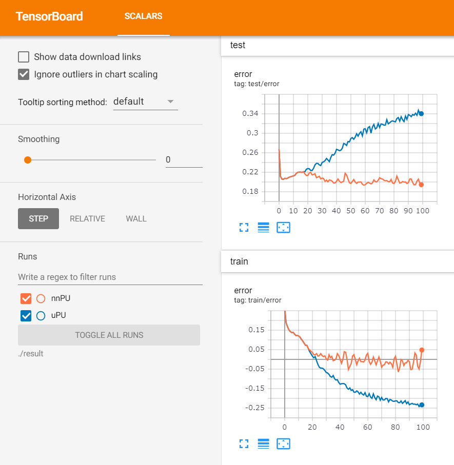

# non-negative PU Learning (nnPULearning)
unofficial pytorch reimplementation of nnPULearning. Official chainer implementation is [here](https://github.com/kiryor/nnPUlearning).

```bash
$ python train.py
$ tensorboard --logdir ./result
```



TODO:
- fix evaluation (calculates mean score by considering batch size)
